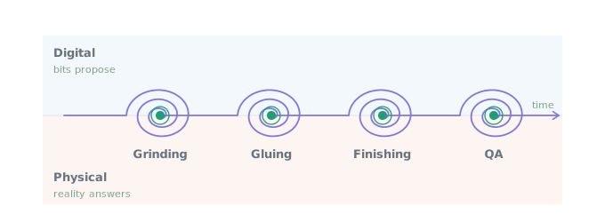

# Convergence — the escalation is the boundary

This document is the structural guidepost for every workflow written in this repository
and every project that inherits its patterns (next: `acme-mono`). Read it before you
write a workflow. It explains not just *how* the patterns work but *why they are shaped
the way they are* — so that when you meet a problem the examples don't cover, you can
derive the answer instead of guessing.

(This is the engineering-grade version of the argument. For the business case in plain
language — the one to hand an operations manager or a skeptical engineer — see
[PERSUASION.md](PERSUASION.md). For how these ideals land on a live production system —
the acme-mono takeover — see [ACME.md](ACME.md).)

## The thesis

**Durable workflow is table stakes.** Replay, retries, timers, exactly-once activity
semantics — these give a process *standing*: the right to exist across crashes and
weeks. Necessary, and not the point.

**The escalation is what makes the system special.** It is the one surface where the
digital process and physical reality touch. The workflow *pushes* on the environment by
creating an escalation — that is pressure. The environment *pulls* to relieve pressure —
scanning, claiming, resolving. The escalation surface is where a workflow's intent and
the world's answer meet, and it is deliberately fuzzy: the escalation may never be
claimed. It may never be resolved. **It will be handled** — by resolution, by timeout,
by cancellation, or by escalating onward to another role. Every outcome is expressible,
so no outcome is a failure of the model.

This was always mislabeled "human-in-the-loop." The human was never the boundary. The
boundary is **digital / physical**: bits propose, reality answers. A human resolving a
review, a print head's sensor reporting done, a vision system rejecting a unit, an SLA
timer firing into silence — all of these are reality pushing back through the same
membrane. Reality will win. The goal is not to prevent that but to find balance: to
guide an imperfect world with pressure, not with explicit, inflexible rules.

## The spiral

A workflow that meets reality is not a straight line with a human checkpoint in it. It
is a **spiral**: at each station the thread crosses the membrane — digital proposes,
physical answers, digital reconciles, physical answers again — and each crossing is
smaller than the last, because each pass closes part of the gap between intent and
actual. Done correctly, the loop is not a cycle that might run forever; it is a spiral
that converges inevitably, because every pass either shrinks the deficit or terminates
through a bounded, expressible outcome (timeout, cancellation, max attempts, escalation
to another role). Convergence is reached, the thread continues to the next station.



A clean pass is the **degenerate case** of the spiral — one crossing, nothing rejected,
straight to the bullseye. Design for the spiral and the happy path costs nothing extra.
Design for the happy path and every defect becomes a special case you didn't model.

## The membrane in one atomic write

The entire boundary is one primitive. `conditionLT` performs a single atomic write that
produces both artifacts a real-world wait needs — the claimable escalation row (the
worklist item, the pressure) and the durable SLA timer — in the same commit:

```ts
const resolution = await conditionLT<Resolution>(signalId, {
  role,                               // who may relieve this pressure (the capability wall)
  metadata: { taskId, ...facets },    // what this pressure is about (the queryable surface)
  timeout: `${slaSeconds} seconds`,   // how long reality gets to answer (durable, same commit)
});
```

The race between human and timer settles atomically **on both sides**:

| settles first | workflow sees | the row becomes | a late actor gets |
|---|---|---|---|
| resolver | the resolver payload | `resolved` | the timer fires inert |
| SLA timer | `false` | `expired` | `already-expired` on resolve |
| cancel | `null` | `cancelled` | — |

That third column is the whole game. An operator can never resolve into a workflow that
already moved on; a workflow can never time out work a human already did. The membrane
is consistent from either shore. `src/workflows/task-queue/` is this primitive stripped
to its minimum — one trigger, one wait, one return — and it is a complete task queue.

## CLAIM / ACK / DELETE — the universal surface, and it is all pull

Nothing on the physical side is ever *commanded*. The workflow raises pressure; the
environment relieves it by pulling:

- **CLAIM** — "I am working this." Sets `assigned_to` and a TTL; status stays `pending`.
  A claim is a lease, not a state — if the claimer goes dark, the TTL returns the work
  to the pool. (There is no "claimed" status; availability is a query, not a hash.)
- **ACK / resolve** — "Here is reality's answer." The resolver payload wakes the parked
  workflow; an outcome patch merges into the row in the same guarded UPDATE. One atomic
  call carries the answer across the membrane and records it.
- **DELETE / cancel** — "This pressure no longer applies." The workflow sees `null` and
  reconciles.

Pull is what makes the surface fuzzy enough to mediate anything. A dashboard operator,
a looping robot singleton, a vision webhook, an MQTT bridge from a print head, an agent
woken by `system.escalation.*.created` — all of them are just *pullers*, indistinguishable
to the workflow. That is why the same surface that runs a human review queue also runs a
printer fleet (`src/workflows/print-routing/`): the interaction contract never changed.

## Everything at the membrane is an actor — even the machines

Print-routing reveals the universality. Give a printer a durable workflow and it gains a
**lifecycle** — it becomes a living entity with motivation:

- When it is free, it *advertises*: a pending `state=ready` escalation is the advert.
- When it needs service, it *asks*: a `state=maintenance` escalation is the request.
- Orders advertise their **demand** the same way — one escalation per insole, grouped by
  `origin_id`, claimed all-or-nothing.
- A broker matches the two ponds by capability (`role` is the hard wall, metadata facets
  the soft fit) and priority (a pluggable, ordered business rule list) — and *resolving
  the printer's advert IS the handoff*.

Supply and demand never call each other. They meet only on the escalation queue. The
surface is fuzzy and adaptive enough to serve as the boundary for a **marketplace** —
which means it is fuzzy enough to serve as the boundary for anything: workstation
associates, grinding benches, gluing stations, QA lanes, delivery trucks. Whether the
puller has hands or a nozzle is an implementation detail below the membrane.

And because every transition is a row, **the record keeping is free**. The escalation
opens with the intent (which machine, which order, which units) and resolves with the
outcome (`result`, rejected units) — one GIN-indexed row, both halves of the story,
`created_at → resolved_at` *is* the duration. A printer's whole life — every run, every
refill, its retirement — is one facet query. No side store to reconcile, ever.

## The convergence loop

The convergence owner is the actor that holds the **original intent** — reconciliation
lives there and nowhere else. Its shape is a fixpoint loop:

```ts
let outstanding = order.units.map((_, i) => i);            // the intent
let attempt = 0;
while (outstanding.length && attempt < MAX_ATTEMPTS) {
  await enqueue({ originId: attempt ? `${orderId}#a${attempt}` : orderId, units: outstanding });
  const done    = await Durable.workflow.condition(orderSignal);      // reality worked
  const signoff = await conditionLT<Signoff>(signoffKey, { role });   // reality judged
  outstanding = signoff.failedUnits;                       // the deficit re-enters the funnel
  attempt += 1;
}
```

Four properties make this a spiral and not a cycle:

1. **The deficit re-enters the same funnel.** A reprint is not a special path — it is a
   fresh origin group sized to the deficit, routed by the identical rules (capability,
   capacity, priority). No second code path to drift out of sync.
2. **Each pass shrinks or terminates.** `outstanding` only ever narrows; `attempt` and
   `MAX_ATTEMPTS` bound the loop; the waits carry their own timeouts. Every exit is a
   modeled outcome, not an exception.
3. **The only nondeterminism crosses the membrane.** Reality's answer (the signoff, the
   sensor, the timeout) is the sole unpredictable input. The loop's *reaction* to it is
   pure and replayable. **Dynamism in the data, determinism in the machinery.**
4. **The predicate is business logic and lives in the workflow.** `intent ≡ actual` is
   readable as a plain `while` condition, survives crashes, replays cleanly — never
   scattered across activities or a side store.

## The laws

When a new situation doesn't match an existing example, derive from these:

1. **The workflow never touches reality — it exerts pressure through the membrane.**
   No direct commands to devices, people, or systems. Raise an escalation; let the
   environment pull. If you find yourself pushing an instruction *at* something
   physical, you are on the wrong side of the membrane.
2. **One wait, one atomic write.** The escalation row and its deadline are born in the
   same commit (`conditionLT`). Never a create-then-wait two-step — the gap between
   them is where signals are lost.
3. **Every outcome is expressible, so handle all of them.** Resolved, `false` (expired),
   `null` (cancelled) — the workflow branches on all three, always. An unhandled branch
   is an unmodeled reality, and unmodeled reality is the only thing that can actually
   break the system.
4. **Handled ≠ resolved.** Timeouts, cancellations, escalations onward to other roles
   are first-class endings. Design so that abandonment converges too.
5. **All interaction is pull; a claim is a lease.** TTLs return orphaned work to the
   pool. Carry over-claimed work forward rather than release-and-reclaim churn; the
   claim TTL is the recovery floor, not the mechanism.
6. **`role` is the hard wall, facets are the soft fit, priority is pluggable business.**
   Capability enforcement lives in the platform (RBAC at the database), matching lives
   in metadata queries, ordering lives in a named rule list you can reorder without a
   deploy.
7. **The row is the record.** Intent at creation, outcome at resolution, duration by
   subtraction. If you are designing a side table to track what the escalation already
   knows, stop.
8. **Convergence, not correctness.** Loop until intent ≡ actual, bounded by attempts
   and time. The clean pass is the degenerate case. Avoid perfection and explicit,
   inflexible rules — guide with pressure, re-enter deficits through the same funnel.
9. **Nothing at the membrane is special.** Humans, printers, robots, webhooks, agents —
   all resolve the same rows through the same API. If a design gives one puller a
   privileged channel, it has broken the marketplace.
10. **Reality wins — plan the balance, not the victory.** The system's job is not to
    force outcomes but to keep pressure flowing until the two solutions equalize. Like
    an osmotic membrane, the escalation mediates two very different solutions, each
    with its own ability to exert pressure. The print failed; grinding failed; the
    order was lost. Model the pushback and the spiral still converges.

## The pattern catalog — where each idea lives

| Pattern | What it proves | Where |
|---|---|---|
| The minimum membrane | One `conditionLT` is a complete task queue: worklist row + SLA + resolve-by-business-key, idempotent start (`workflowId = task-<taskId>`) | `src/workflows/task-queue/` |
| Stations on a line | A pipeline is stations; each station is one wait at the membrane; the parent composes them (`executeChild`) | `src/workflows/ortho-pipeline/` (`pipeline.ts`, `station.ts`) |
| Fleets in parallel | All printers start together, finish independently; `Promise.all` over children | `src/workflows/ortho-pipeline/printstation.ts` |
| The marketplace | Supply and demand as two ponds of escalations; the broker as market maker; printers as living entities; availability as a query | `src/workflows/print-routing/` (`README.md`, `ARCHITECTURE.md`) |
| The convergence loop | Fixpoint reconciliation: deficits re-enter the same funnel until intent ≡ actual | `print-routing/workflows/order.ts`, proven by `print-routing-defect.test.ts` |
| Carry, don't release | Over-claimed work is held and placed next tick; TTL is the backstop | `print-routing-carry.test.ts` |
| Pluggable priority | Business ordering as a named rule list composed into the claim | `print-routing/policy/priority.ts`, `print-routing-priority.test.ts` |
| Hard wall / soft fit | `role` gates capability at the DB; facets + overflow rules do soft matching | `print-routing/policy/capability.ts`, `print-routing-overflow.test.ts` |
| Escalation-to-other-escalation | SYSTEM attempts exhausted → hop to HUMAN and back, bounded by `hops`/`maxHops` | task-queue README, "five scenarios" |

## Where this goes

This repository is the AWS test bed; the destination is `acme-mono`, where the full
lifecycle runs end to end: **a fax arrives** (a prescription for a diabetic orthotic) →
intake → video of the patient's feet → 3-D renders → orthotic insole models → gcode
slices → printed on the farm → harvested → ground, glued, finished by human and
automation teams → QA → delivered. Every arrow in that chain is a station on the
spiral. Every station is one wait at the membrane. Every handoff — to a printer, a
workstation associate, a vision check, an outside courier — is an escalation raised,
pulled, and settled by the same CLAIM/ACK/DELETE surface. Nothing along the way is
guided to completion by inflexible rules; everything is guided by pressure, and every
deficit spirals back through the same funnel until it converges.

That is what "workflows that never fail" means. Not workflows where nothing goes wrong —
workflows where **everything that can happen has a modeled ending**, and the loop's
shape guarantees the endings are reached.

## Checklist — before you ship a workflow

- [ ] Every physical-world interaction is an escalation the environment pulls — the
      workflow commands nothing directly.
- [ ] Every `conditionLT` handles all three settlements: payload, `false`, `null`.
- [ ] Deadlines ride in the same atomic write as the wait (`timeout` on `conditionLT`),
      never a separate timer.
- [ ] The convergence owner is identified, holds the intent, and runs the fixpoint loop;
      deficits re-enter the same funnel as fresh origin groups.
- [ ] The loop is bounded — attempts, hops, EOL, or SLA — and every exit is a modeled
      outcome in the return value.
- [ ] Ids are deterministic and business-keyed (`task-<taskId>`, `<orderId>#a<attempt>`)
      so starts are idempotent and resolution needs no handle.
- [ ] State is queried, never mirrored: no side store shadowing what the escalation rows
      already record.
- [ ] Roles gate capability; facets carry the matchable surface; priority is a named,
      reorderable rule list.
- [ ] Infinite loops use `continueAsNew`; bounded lifecycles use plain `while` and end
      as workflow completion.
- [ ] The whole story — work to do, work done, time taken, what retried, what retired —
      is answerable by facet queries over the escalation surface.
